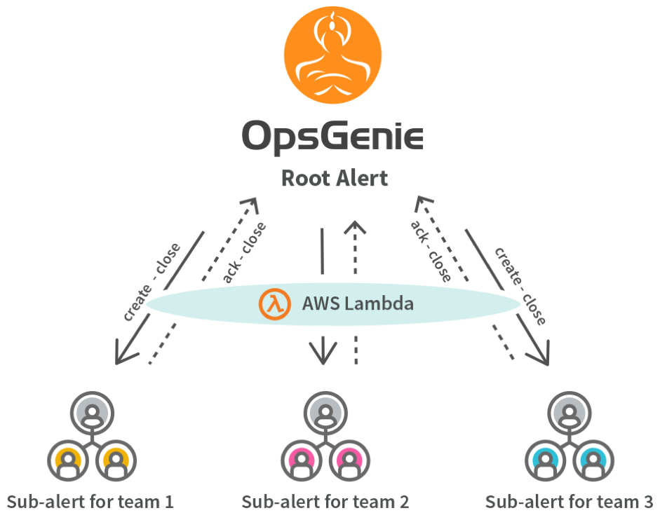

In this solution, we used requests library, because it makes handling HTTP very easy. If you’re
going to run the script on AWS Lambda, you need to define an entry point and you need to specify the
entry point when deploying the lambda function. We used lambda_handler(event, context) method as our
entry point. Python lets you define methods in methods. So, we defined the methods we needed in this
lambda_handler method.

OpsGenie has general Webhook Integration and can make requests to given endpoints when actions
happen. In the solution, we leveraged this ability. For example, when an alert is created in
OpsGenie, some information about the alert is sent to the endpoint that we supplied to the Webhook
Integration. API Gateway takes the payload sent by the Webhook Integration and puts it into the
event object before running the script so that we can use it in our script.

An OpsGenie alert has fields such as message, description and extra properties. Alert message is a
short, 130 characters limited field. This field gives you a high level idea of what the problem is
about. Description on the other hand, is unlimited and can include very rich information about the
problem. The extra properties field is a key-value paired field that can include additional details
about the problem. As you can think of, when sending payload over HTTP/S protocol, keeping the
payload as short as possible is a goal. For this reason, the description and extra properties fields
are not included in the Webhook message. We needed to get this information by making a Get Alert
request to OpsGenie’s Alert API. In order to make a request to OpsGenie API, you need to have an API
Key from an OpsGenie API Integration. In addition, you can use the API Key of the Default API
Integration. At the beginning of the script, we defined a configuration part for OpsGenie Alert API
endpoints and the API Key which would be used when making the requests to OpsGenie API.

After getting the detailed information about the alert, we need to determine which action happened
by getting the action field from the payload. This field specifies the name of the action that the
webhook message was sent for. If the action is a create action, it means the webhook message was
sent because a new alert has been created. Then we check whether the alert has the teamsToNotify
extra field. This field is used for determining teams that we’re going to create a sub-alert for
each. So, if the alert has teamsToNotify field, it’s a root alert. Root alert means that the
information on the alert will be used to create the sub-alerts. So, we defined a method called
createSubAlerts to handle creating sub-alerts. We call this method if the alert is a root alert. If
it doesn’t have the teamsToNotify field, we simply ignore the webhook message because create actions
for sub-alerts is not a concern for us.

If the action is acknowledge, we check if the alert has rootAlertId extra field. When we create the
sub-alerts, we add this rootAlertId extra field to these sub-alerts in order to determine which
sub-alert belongs to which root alert. If the alert has the rootAlertId extra field, it means that
the webhook message was sent because of an action executed on one of the sub-alerts. We had a use
case of adding a note to the root alert, when one of the sub-alerts was acknowledged. We handle this
in a method called addNoteToTheRootAlert. If the action is acknowledge, but the alert doesn’t have
the rootAlertId extra field, we just ignore the webhook message, because acknowledging the root
alert had no effect in our case.

Our last check is for the close action. If the action is close, we close all the sub-alerts and the
root alert together since closing one of the alerts means that the problem had been solved. We
handled this case in a method called closeRootAndSubAlerts.

Let’s take a look at the methods that we defined to handle these cases.

#### createSubAlerts
We use this method when the webhook message is for the root alert. In the method, we get the data of
the alert from the webhook message and add the missing description and details fields that we have
from the get alert request that we made to OpsGenie Alert API. After creating a template for
sub-alert, we loop through the teams that we get from the teamsToNotify field of the root alert to
create a sub-alert for each team in this list. In the loop, we add the team to the teams field of
the sub-alert. Then we remove the teamsToNotify field from the extra properties in order not to make
it a root alert and cause an endless loop to happen. After these operations, we create the alert by
making a Create Alert request to OpsGenie Alert API. As you can remember, we add the ID of the alert
as a tag to the root alert. So, we make an Add Tag Request to OpsGenie Alert API and add the ID of
the newly created sub-alert to the root alert as a tag. We get the ID of the newly created alert
from the response of the create alert request.

#### addNoteToTheRootAlert
We use this method when the webhook message is for the sub-alerts. In the method, we first determine
the rootAlertId from the sub-alert. As you can remember, we added the ID of the root alert as an
extra property to the sub-alerts when we created the sub-alerts. We accept acknowledge actions for
the sub-alerts. So, this method is used when a sub-alert is acknowledged. We determine the user and
team that acknowledged the sub-alert from the username and teams fields of the webhook message.
Then, we make an Add Note request to OpsGenie Alert API and add the note to the root alert as a
note.

#### closeRootAndSubAlerts
We use this method when the action is close. In the method, we first determine if the alert is a
root alert or a sub-alert. As you can remember we use extra properties of the alert to do that. If
the alert has teamsToNotify extra property, that means it’s a root alert. On the other hand, if it
has rootAlertId extra property, it means it’s a sub-alert. If the alert is a root alert, we loop
through its tags. Since we added the sub-alert IDs to the root alert when we created the sub-alerts,
in the loop, we send a Close Alert request to OpsGenie Alert API for each sub-alert. In our use
case, we need to close the root alert and all the sub-alerts. So, if the alert is a sub-alert, first
we get rootAlertId from its properties. Then, with this ID, we make a Get Alert request to OpsGenie
Alert API and get the information about the root alert. After getting the root alert, we loop
through its tags and send a close request for each sub-alert as mentioned above. Finally, we make a
close alert request for the root alert and finish the process.

# Installation
* Copy the API Key of an API integration (you can also use the API Key of the Default API
integration) and paste it into the script as the value of the **opsGenieAPIKey** variable
(Replace **&lt;Your OpsGenie API Key&gt;**).
* Compress **AlertsPerTeam.py** file and **request** folder together.
* Create a new lambda function in **AWS Lambda Service**.
* Set **API Gateway** as the trigger of the lambda function.
* Select the compressed archive that you've created to upload in **AWS Lambda Service**.
* Create a Webhook integration in OpsGenie.
* Paste the endpoint given by API Gateway into the **Webhook URL** field.
* If you've associated an API Key in API Gateway, enter a header in the **Custom Headers** field as
follows:
    * Header: **x-api-key**
    * Value: API Key given by API Gateway
* You can de-select the actions other than Create, Acknowledge and Close. The script will also
ignore the other actions, but you may not want to send unnecessary actions to AWS.
* You can select an **Alert Filter**, if you don't want to create sub-alerts from every alert.
* Save the integration.